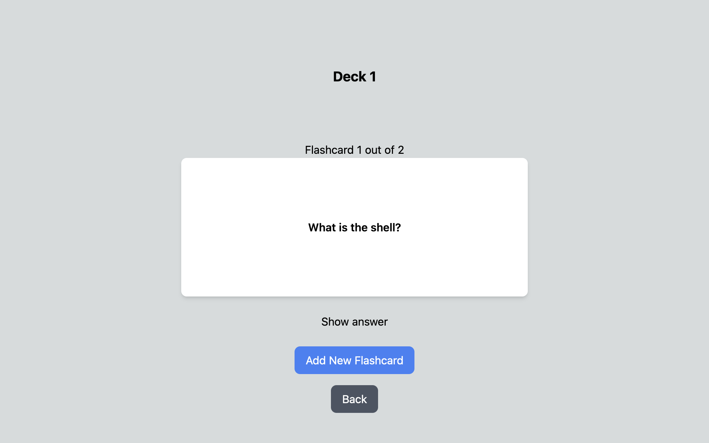

# Flashcards


Flashcard application that allows users to:

- Create new decks
- Add flashcards to a deck
- Play through a deck, seeing one flashcard at a time
- Marking each flashcard as "remembered" or "not remembered"

The app is containerised using `docker-compose`, and includes some unit tests.

**Stack:** Typescript, Next.js (React), Tailwind CSS, Express.js (Node), MySQL

## Run

First, run the development server:

```bash
docker compose up
```

Open [http://localhost:3001](http://localhost:3001) with your browser and enjoy!
When you're done, you can stop the server with `Ctrl+C` or by running:
    
```bash
docker compose down
```

## Test
With the containers running, open a new terminal and run:
```bash
docker compose exec backend npm run test -- --verbose
```

### TBD
#### Backend:
- Integration tests
- Add algorithm to shuffle cards

#### Frontend:
- Unit and integration tests
- Notify user of errors (right now it's just console.error)
- Improve code readability by splitting into smaller reusable components
- Setup prettier, check config eslint and add husky
- Add a loading spinner when fetching data
- Add dark mode compatibility
- Improve overall UI/UX